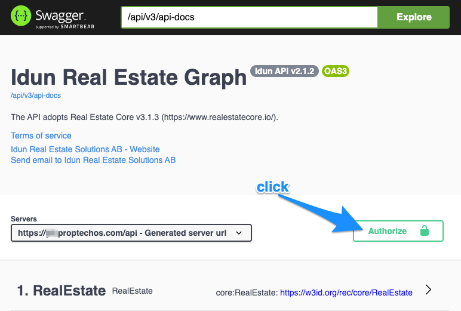
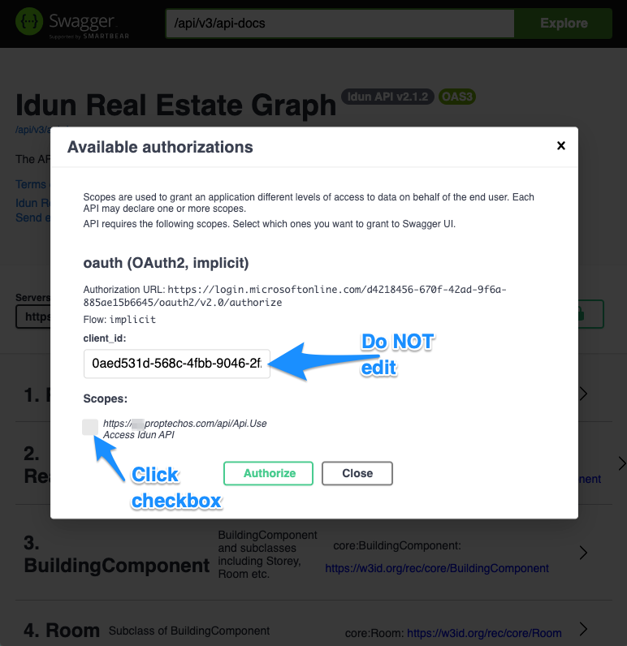
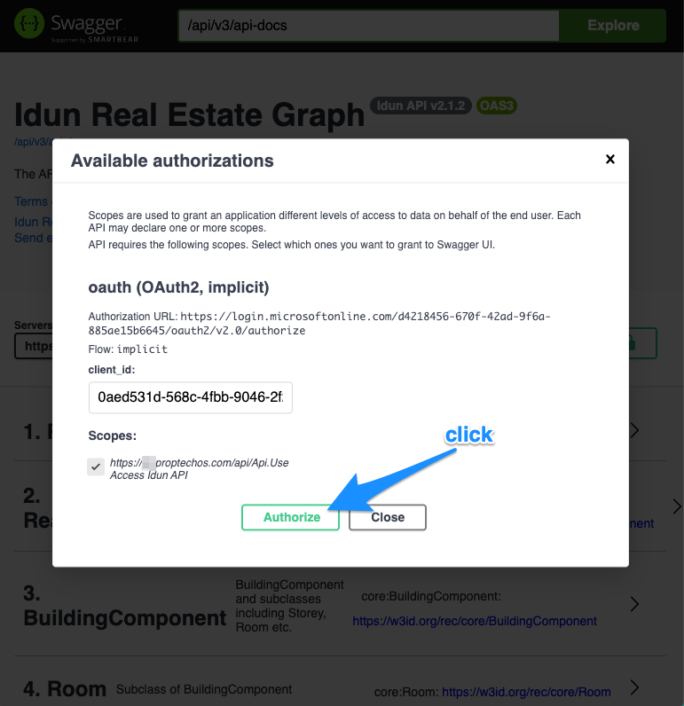
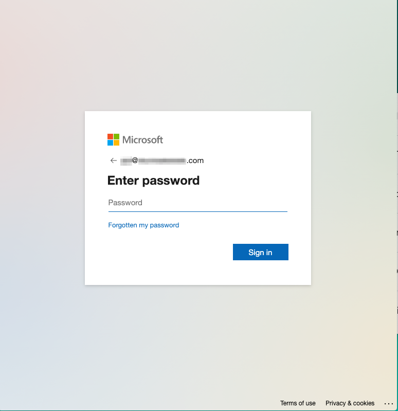
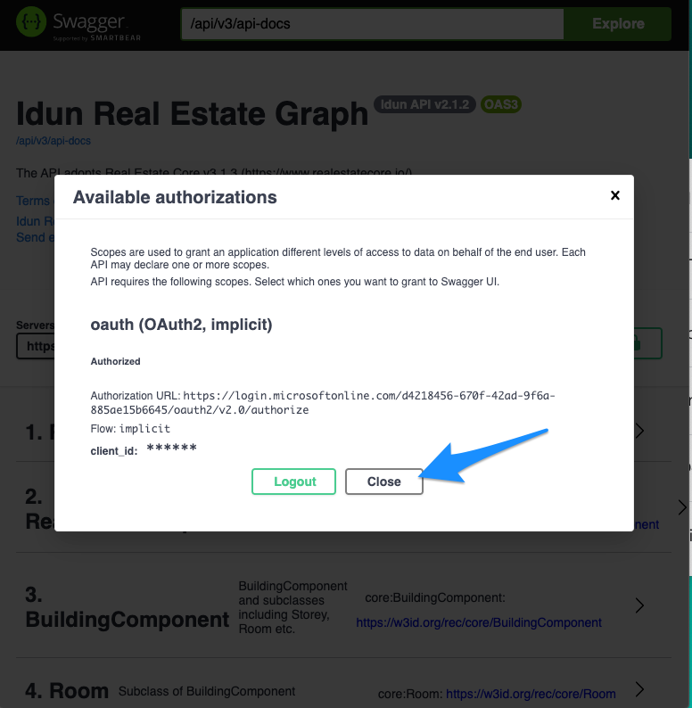
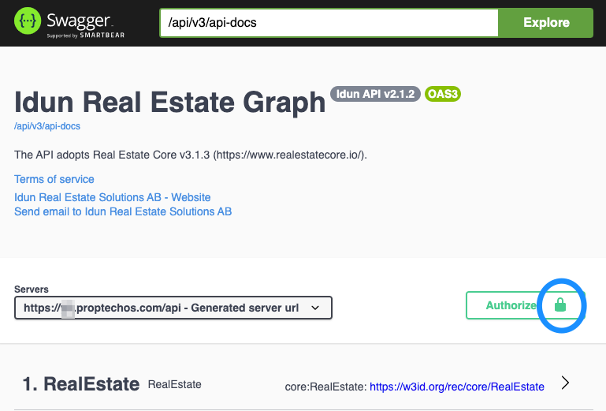

# API

The resources and state of them are exposed via an endpoint each per top level class, with GET and POST methods for reading and creating/changing them. Please see Open API Specification (Swagger) docs for up-to-date details.

# Authentication

Authentication in ProptechOS uses OAuth 2.0 protocol.
It can be separated into two categories:
* interactive authentication (for applications accessing the API on behalf of user, like web apps and UIs)
* application (daemon) authentication, for applications working without user interaction.

See more in [the Authentication section](authentication)

# JSON and JSON-LD
The API follow RealEstateCore, which means JSON-LD and [hydra](https://hydra-cg.com). (link to JSON-LD parsers to be added here). However ProptechOS also includes plain JSON versions of all endpoints using the `/json/` prefix for the endpoints. E.g. the `/api/sensor` endpoint has a JSON version at `/api/json/sensor`.

Note that besides the endpoints and the contents being different, the different flavours of endpoints rely on different content type headers:

_JSON-LD_  
`type: application/ld+json`  
Using curl: `-H "accept: application/ld+json"`

_JSON_  
`type: application/json`  
Using curl: `-H "accept: application/json"`

# Aliases and AliasNamespaces

See more in [the Alias and AliasNamespace section](alias-aliasnamespace)

# Using the Swagger docs
Authentication step-by-step walkthrough
## 1. Click the Authorize button.
The padlock is unlocked, meaning you are not autorized.

## 2. Click the checkbox
Do **NOT** change the client_id - leave it as is.

## 3. Click Authorize

## 4. Log in with your ProptechOS account
You will be taken to a Microsoft sign-in page.
If you are already signed in, this will not be needed, and if you are signed in with another Microsoft user, you might need to log out of that account, before signing in with your ProptechOS user.
If you do not have a ProptechOS user account, you will not be able to get authorized.

## 5. Click close
You will be returned to the ProptechOS swagger doc.
You have now successfully autorized.

## 6. Done.
The padlock is now locked, indicating that you are authorized.

# Choosing the Property Owner for Swagger operations
## 1. Get the list of available Property Owners

## 2. Choose the Property Owner to use for requests

## 3. Click Authorize.

## 4. Insert Property Owner ID and click Authorize.

## 5. Click close.

## 6. Done.
